# Example Styles

This directory contains ready-to-use `config.toml` examples for Mercury.

Use one by copying its contents into your working `config.toml`.

## Minimal Light

File: `minimal-light.toml`

Notebooks view:

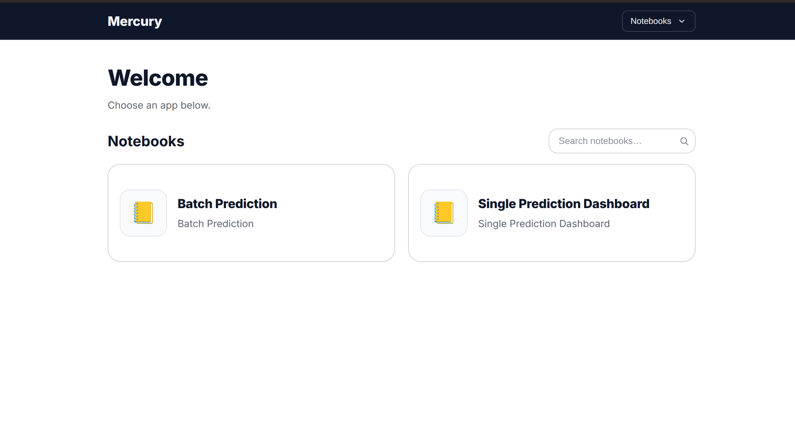

App view:

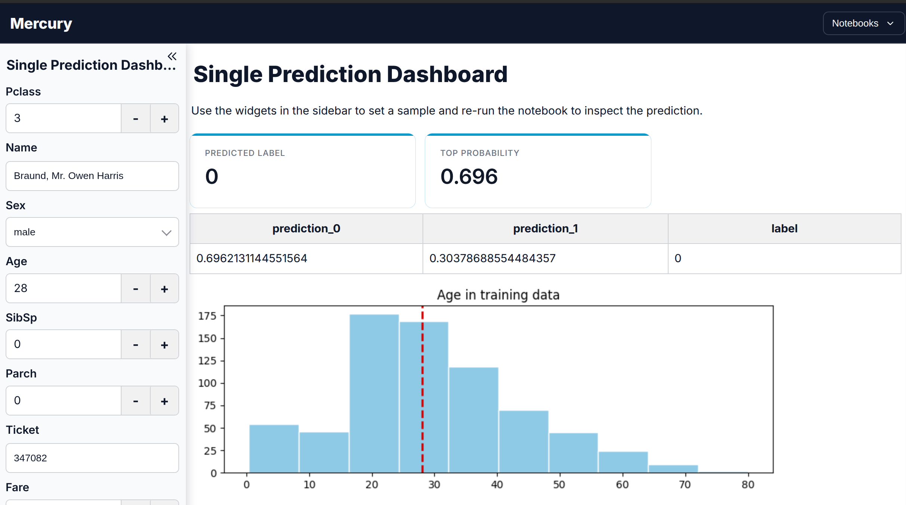

## Dark Ops

File: `dark-ops.toml`

Notebooks view:

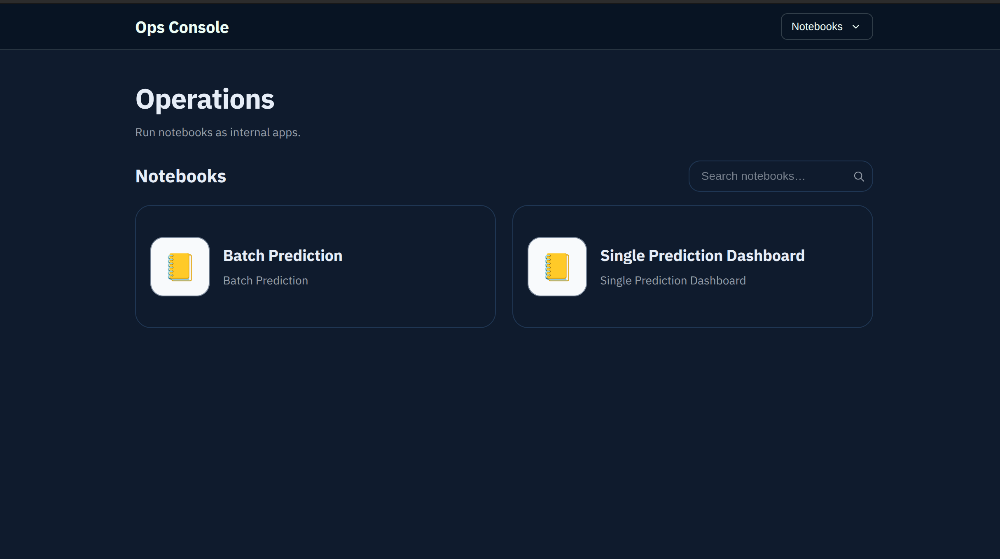

App view:

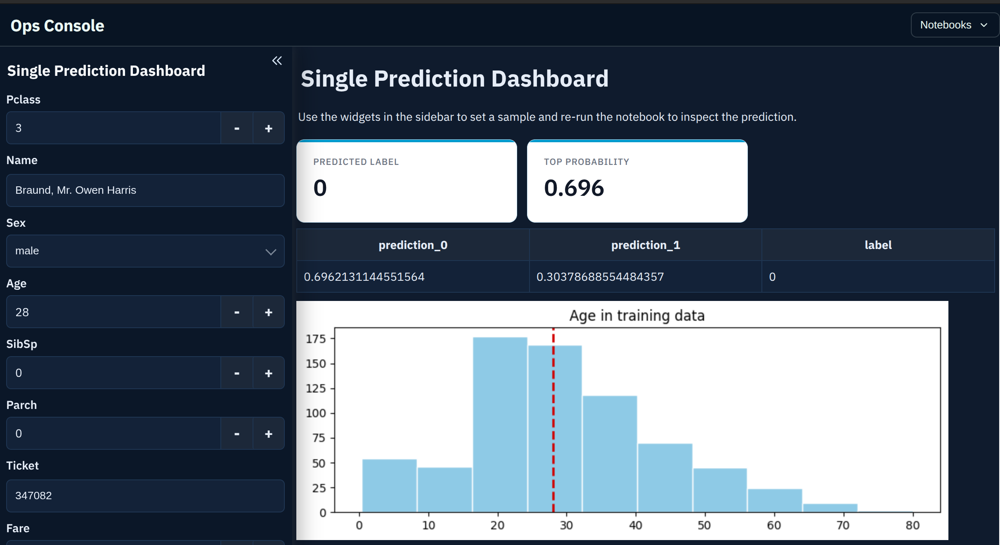

## Editorial Serif

File: `editorial-serif.toml`

Notebooks view:

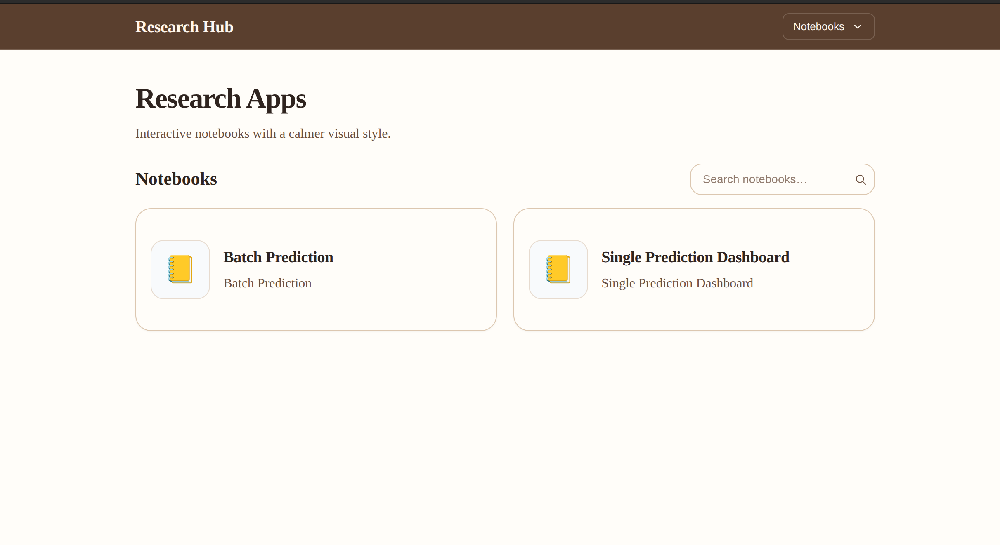

App view:

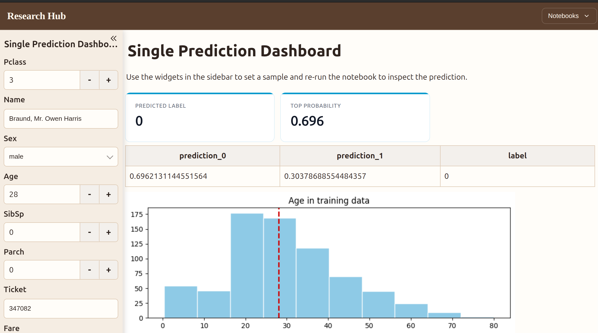

## Neon Terminal

File: `neon-terminal.toml`

Notebooks view:

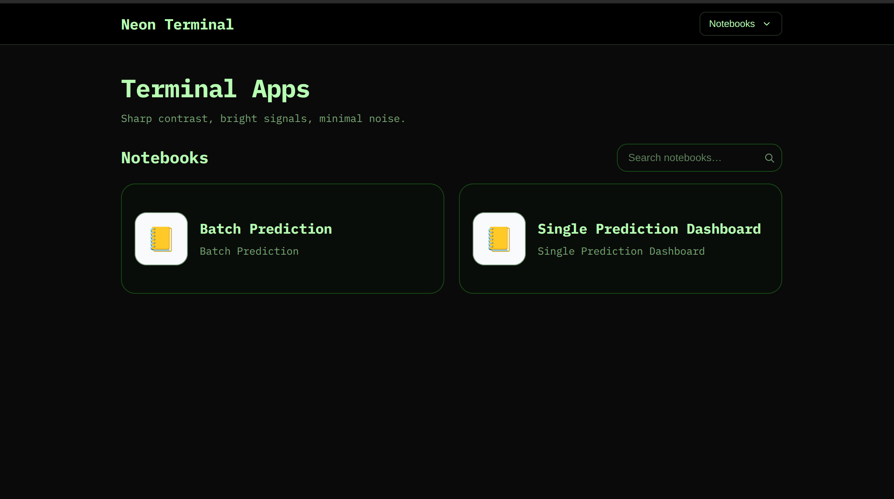

App view:

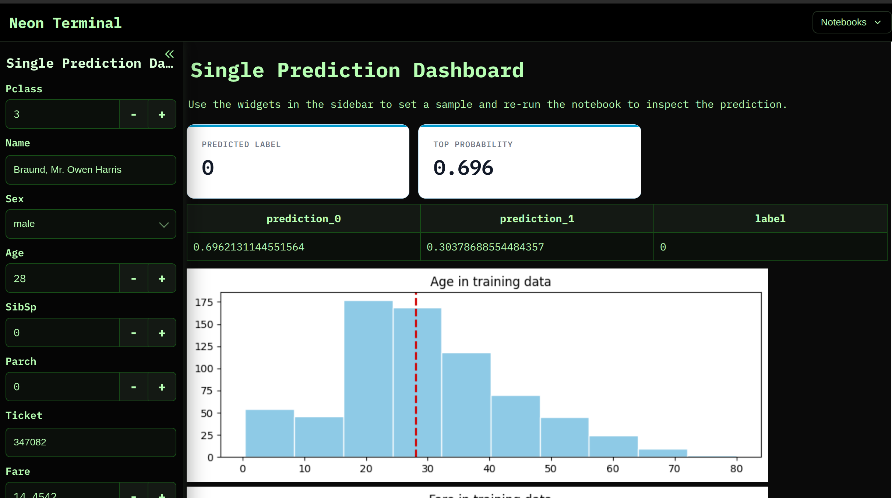

## Corporate Blue

File: `corporate-blue.toml`

Notebooks view:

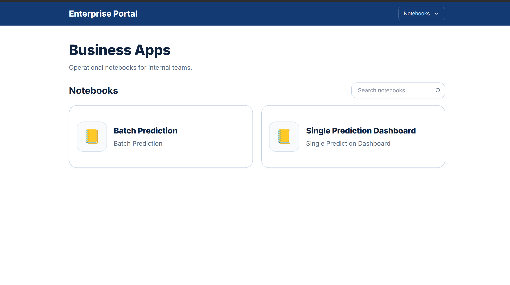

App view:

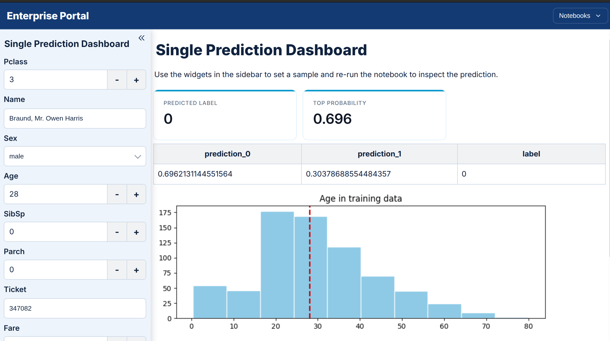

## Pastel Studio

File: `pastel-studio.toml`

Notebooks view:

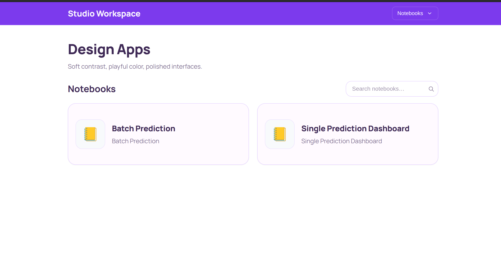

App view:

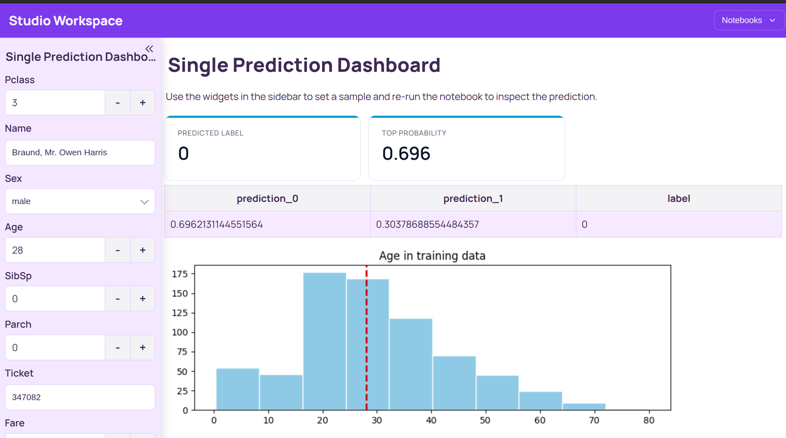

## Warm Sand

File: `warm-sand.toml`

Notebooks view:

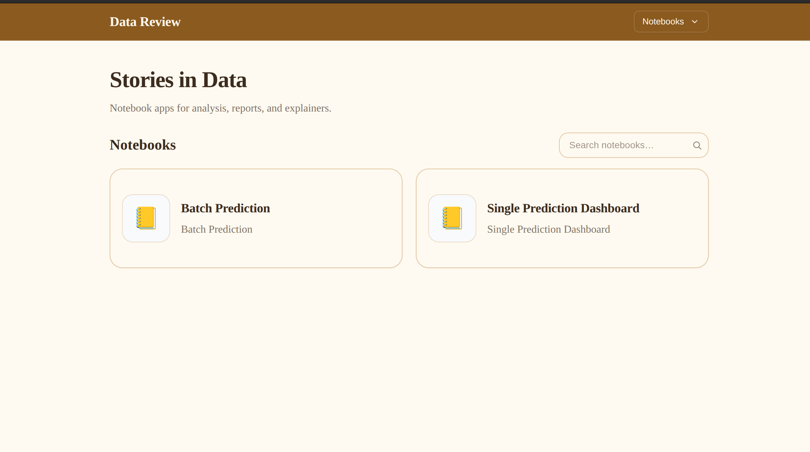

App view:

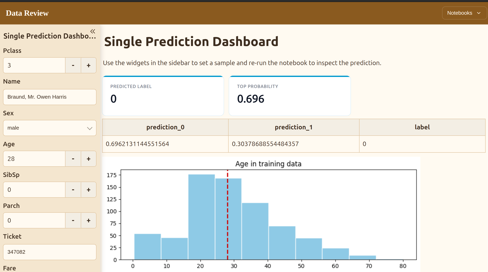

## Slate Dark

File: `slate-dark.toml`

Notebooks view:

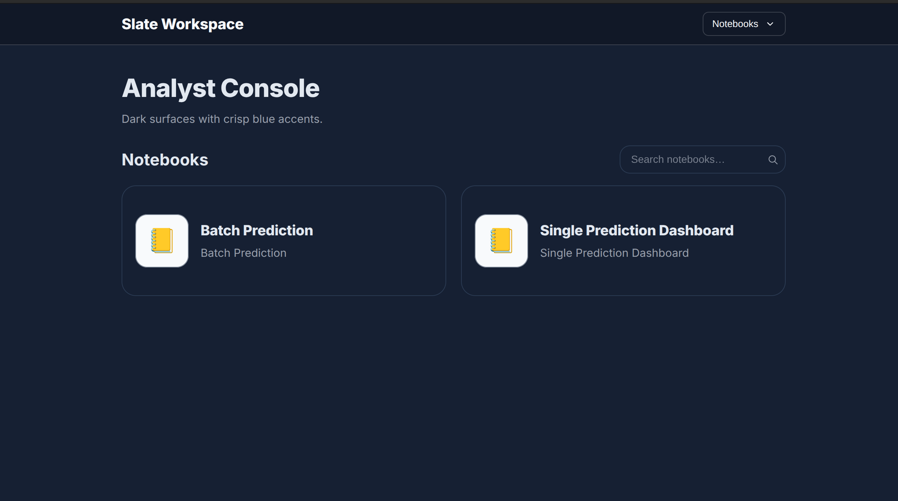

App view:

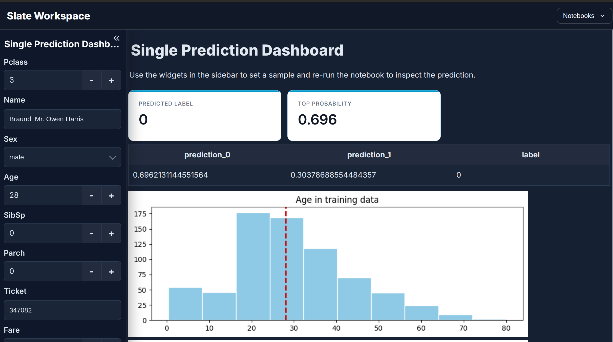

## Forest Bio

File: `forest-bio.toml`

Notebooks view:

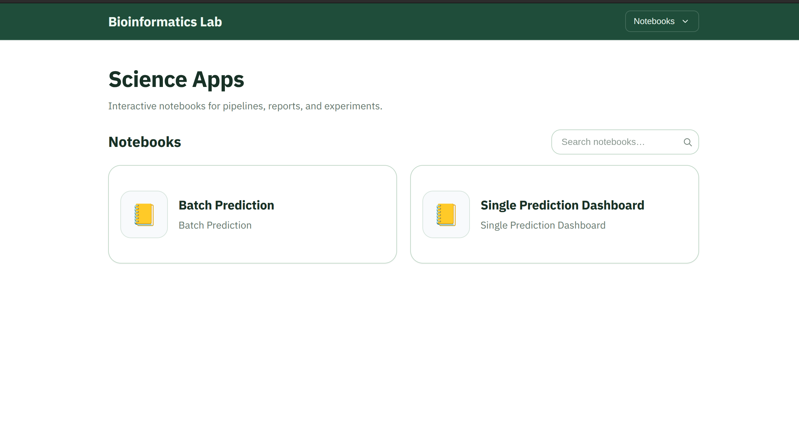

App view:

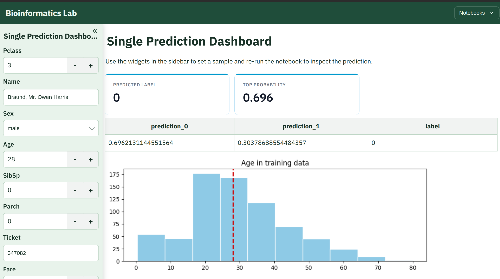
